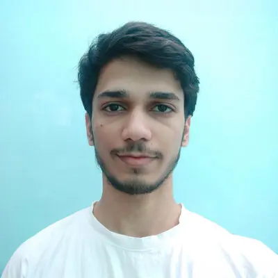
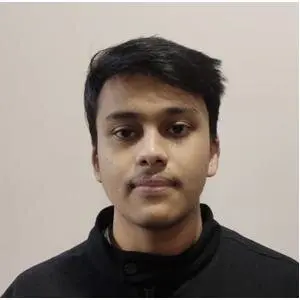
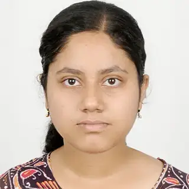
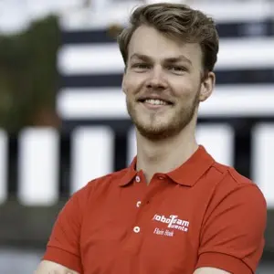
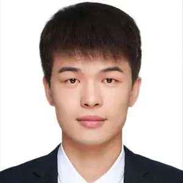

# Present Team

## Vatsal Sanjay (PI) 
[<i class="fab fa-github" style="font-size: 2.5em; color: black;"></i>](https://github.com/VatsalSy)
[<i class="ai ai-google-scholar-square" style="font-size: 2.5em;"></i>](https://scholar.google.com/citations?user=67aQviYAAAAJ)

- [Postdoc, Phys. Fluids - Univ. Twente / 2022-25](https://pof.tnw.utwente.nl/people/profile/1330)
- [Ph.D., Phys. Fluids - Univ. Twente / 2018-22](https://doi.org/10.3990/1.9789036554077)
- [B.Tech + M.Tech, Two-Phase Flow & Instability Lab, IIT-Roorkee / 2013-18](http://dx.doi.org/10.13140/RG.2.2.22294.04166)
- [Personal Website](https://vatsalsanjay.com)

**Research Interest:** see [here](https://comphy-lab.org/research)

[Download CV](https://raw.githubusercontent.com/VatsalSy/Vatsal_CV/master/Vatsal_CV.pdf){: .cv-button}

## Ayush Dixit (Ph.D) 
[<i class="fab fa-github" style="font-size: 2.5em; color: black;"></i>](https://github.com/ayushkumardixit)
[<i class="ai ai-google-scholar-square" style="font-size: 2.5em;"></i>](https://scholar.google.com/citations?hl=en&user=ws43SmkAAAAJ)

Joint with [Detlef Lohse](https://en.wikipedia.org/wiki/Detlef_Lohse)

- [Ph.D. Student, Phys. Fluids - Univ. Twente / 2023-now](https://pof.tnw.utwente.nl/people/profile/2068)
- [B.Tech + M.Tech, Two-Phase Flow & Instability Lab, IIT-Roorkee / 2018-23](http://dx.doi.org/10.13140/RG.2.2.23218.79040)

**Research Interest:** Viscoelastic flows, Bursting bubbles, Respiratory drops.

## Aman Bhargava (Ph.D) 
[<i class="fab fa-github" style="font-size: 2.5em; color: black;"></i>](https://github.com/amanb1901)
[<i class="ai ai-google-scholar-square" style="font-size: 2.5em;"></i>](https://scholar.google.com/citations?hl=en&user=AmGOP8gAAAAJ)

Joint with [Detlef Lohse](https://en.wikipedia.org/wiki/Detlef_Lohse)

- [Ph.D. Student, Phys. Fluids - Univ. Twente / 2024-now](https://pof.tnw.utwente.nl/people/profile/2120)
- M.Sc. Chemical Engineering, Purdue University / 2022-23
- B.Tech. (Hons.) Chemical Engineering, IIT-Bombay / 2018-22

**Research Interest:** Inertial contact line, Drop retraction

## Jnandeep Talukdar (M.Sc.) 
[<i class="fab fa-github" style="font-size: 2.5em; color: black;"></i>](https://github.com/spilltheT)
[<i class="ai ai-google-scholar-square" style="font-size: 2.5em;"></i>](https://scholar.google.com/citations?hl=en&user=Coxj4VQAAAAJ)

Joint with [Detlef Lohse](https://en.wikipedia.org/wiki/Detlef_Lohse)

- Ph.D. Student, Phys. Fluids - Univ. Twente / **starting** May 2025
- [M.Sc. Student, Phys. Fluids - Univ. Twente / 2023-25](https://pof.tnw.utwente.nl/people/profile/1938)
- B.Tech. Mechanical Engineering, IIT-Patna / 2019-23

**Research Interest:** Surfactant dynamics, Dissipative anomaly, Soft wetting.

## Saumili Jana (M.Sc.) 
[<i class="fab fa-github" style="font-size: 2.5em; color: black;"></i>](https://github.com/SaumiliJana)

Joint with [Detlef Lohse](https://en.wikipedia.org/wiki/Detlef_Lohse)

- Ph.D. Student, Phys. Fluids - Univ. Twente / **starting** Jul 2025
- B.Tech.+M.Tech. Student, IIT-Kharagpur / 2020-25
- [Research Intern, Phys. Fluids - Univ. Twente / 2024](https://pof.tnw.utwente.nl/people/profile/2152)

**Research Interest:** Soft impact.

## Floris Hoek (M.Sc.) 
[<i class="fab fa-github" style="font-size: 2.5em; color: black;"></i>](https://github.com/Floris-Hoek)

Joint with [Martin van der Hoef](https://pof.tnw.utwente.nl/people/profile/244) and [Alvaro Marin](https://pof.tnw.utwente.nl/people/profile/243)

- [M.Sc. Student, Phys. Fluids - Univ. Twente / 2024](https://pof.tnw.utwente.nl/people/profile/1937)

**Research Interest:** Molecular dynamics simulations of evaporation-driven colloidal self-assembly

## Milan Sent (B.Sc.) 
[<i class="fab fa-github" style="font-size: 2.5em; color: black;"></i>](https://github.com/mdjsent)

Joint with [Jacco Snoeijer](https://pof.tnw.utwente.nl/people/profile/21)

- [B.Sc. Student, Phys. Fluids - Univ. Twente / 2024](https://pof.tnw.utwente.nl/people/profile/2243)

**Research Interest:** Spinning Pizza

## Xiangyu Zhang (Intern) 
[<i class="fab fa-github" style="font-size: 2.5em; color: black;"></i>](https://github.com/zhangxyPHD)

Joint with [Detlef Lohse](https://en.wikipedia.org/wiki/Detlef_Lohse)

- [Guest Researcher, Phys. Fluids - Univ. Twente / 2024](https://pof.tnw.utwente.nl/people/profile/2209)
- City University of Hong Kong, China

**Research Interest:** Viscoplastic drop impact

## We need you!

See: [Join Us](https://github.com/VatsalSy/Project-ideas-for-prospective-students) for ongoing projects.

# Our Collaborators

## Detlef Lohse
[<i class="ai ai-google-scholar-square" style="font-size: 2.5em;"></i>](https://scholar.google.com/citations?user=WvP_pIUAAAAJ&hl=en&inst=5726176096060060532&oi=sra)
[<i class="fa fa-wikipedia-w" style="font-size: 2em; color: #000000;"></i>](https://en.wikipedia.org/wiki/Detlef_Lohse)

- [Professor, Phys. Fluids - Univ. Twente](https://pof.tnw.utwente.nl/people/profile/3)

**Collaboration on:** Drop imapct, Viscoelastic flows, Dissipative anomaly, Surfactant dynamics, Electrolysis, Bubbles, and everything in between.

## Jacco Snoeijer
[<i class="ai ai-google-scholar-square" style="font-size: 2.5em;"></i>](https://scholar.google.com/citations?user=lW9yvvwAAAAJ)

- [Professor, Phys. Fluids - Univ. Twente](https://pof.tnw.utwente.nl/people/profile/21)

**Collaboration on:** Elastic sheets, Viscoelaticity vs. elasticity, Spinning pizza.

## Alvaro Marin
[<i class="ai ai-google-scholar-square" style="font-size: 2.5em;"></i>](https://scholar.google.com/citations?user=kCbF5qUAAAAJ)
[<i class="fab fa-github" style="font-size: 2.5em; color: black;"></i>](https://github.com/alvarogum)

- [Adjunct Professor, Phys. Fluids - Univ. Twente](https://pof.tnw.utwente.nl/people/profile/243)

**Collaboration on:** Colloidal systems, Evaporation, Shell formation.

# Our Alumni

## Valentin Rosario
[<i class="fab fa-linkedin" style="font-size: 1.5em; color: black;"></i>](https://www.linkedin.com/in/valentin-rosario-6377602b2/?originalSubdomain=nl)
[<i class="fab fa-github" style="font-size: 2em; color: black;"></i>](https://github.com/ValeRos9)

- **2024:** Graduated with M.Sc., Univ. Amsterdam
- **Thesis:** [Modelling the Ward--Hunt ice-shelf as viscoelastic solid](https://tinyurl.com/2cjsjvr4)

## Swen van den Heuvel
[<i class="fab fa-linkedin" style="font-size: 1.5em; color: black;"></i>](https://www.linkedin.com/in/swen-van-den-heuvel-33a1901aa/)

- **Now:** [Ph.D. Student, Phys. Fluids - Univ. Twente](https://pof.tnw.utwente.nl/people/profile/2119)
- **2023:** [Graduated with M.Sc., Univ. Twente](https://pof.tnw.utwente.nl/people/profile/2119)
- **Thesis:** [Hydrodynamic forces acting on vertically rising bubbles](https://bit.ly/4er5VaH)

## Niels Kuipers
[<i class="fab fa-linkedin" style="font-size: 1.5em; color: black;"></i>](https://www.linkedin.com/in/nielskuipers1/)

- **Now:** M.Sc. Student, Adv. Technology - Univ. Twente
- **2023:** [Graduated with B.Sc., Univ. Twente](https://pof.tnw.utwente.nl/people/profile/2064)
- **Thesis:** [Partial coalescence of drops on viscous films](https://tinyurl.com/258jvdyv)

## C. H. (Luuk) Maurits

- **2023:** [Graduated with M.Sc., Univ. Twente](https://pof.tnw.utwente.nl/people/profile/1741)
- **Thesis:** [When Laplace meets Marangoni](https://bit.ly/ThesisLuuk)

## Tom Appleford

- **Now:** [Ph.D. Student, Fluid Lab - Univ. Amsterdam](https://www.fluidlab.nl/team)
- **2022:** [Graduated with M.Sc., Univ. Amsterdam](https://pof.tnw.utwente.nl/people/profile/1741)
- **Thesis:** [The deformation of a droplet in a viscoplastic simple shear flow](https://bit.ly/ThesisTom)

## Twan Heijink
[<i class="fab fa-linkedin" style="font-size: 1.5em; color: black;"></i>](https://www.linkedin.com/in/twanheijink/)

- **Now:** Software IVQA Engineer at Thales
- **2021:** [Graduated with B.Sc., Saxion Univ.](https://pof.tnw.utwente.nl/people/profile/1822)
- **Thesis:**  [Standing waves at a fluid-fluid interface with plastocapillarity](https://bit.ly/ThesisTwanHeijink)

## Steven Meuleman
[<i class="fab fa-linkedin" style="font-size: 1.5em; color: black;"></i>](https://www.linkedin.com/in/steven-meuleman/)

- **Now:** Mechanical Engineer at VIRO
- **2020:** Graduated with B.Sc., Univ. Twente
- **Thesis:** [Simulations of foam generation for a custom axisymmetric core-shell nozzle](https://bit.ly/ThesisStevenM)

## Thijmen Kroeze
[<i class="fab fa-linkedin" style="font-size: 1.5em; color: black;"></i>](https://www.linkedin.com/in/thijmen-kroeze-535aa3207/)

- **Now:** CFD Engineer, Brink Climate Systems
- **2020:** [Graduated with B.Sc., Univ. Twente](https://pof.tnw.utwente.nl/people/profile/1630)
- **Thesis:** [Singular jet dynamics of drop impacts at high Bond numbers](https://bit.ly/ThesisThijmenKroeze)

## Coen Verschuur

- **Now:** [Ph.D. Student, Phys. Fluids - Univ. Twente](https://pof.tnw.utwente.nl/people/profile/1709)
- **2020:** [Graduated with B.Sc., Univ. Twente](https://pof.tnw.utwente.nl/people/profile/1709)
- **Thesis:** [Early time dynamics in immiscible drop impacts](https://bit.ly/ThesisCoenVerschuur)

## Pim J. Dekker
[<i class="fab fa-linkedin" style="font-size: 1.5em; color: black;"></i>](https://www.linkedin.com/in/pim-dekker/)

- **Now:** [Ph.D. Student, Phys. Fluids - Univ. Twente](https://pof.tnw.utwente.nl/people/profile/1431)
- **2019:** [Graduated with B.Sc., Univ. Twente](https://pof.tnw.utwente.nl/people/profile/1431)
- **Thesis:** [Spreading of a drop on a water-air interface](https://bit.ly/ThesisPimDekker)

## Laurence Bruggink
[<i class="fab fa-linkedin" style="font-size: 1.5em; color: black;"></i>](https://www.linkedin.com/in/laurence-bruggink-b733b222a/)

- **Now:** Research Engineer at Alfen
- **2019:** [Graduated with B.Sc., Univ. Twente](https://pof.tnw.utwente.nl/people/profile/1518)
- **Thesis:** [Bursting bubble in a Herschel--Bulkley fluid](https://bit.ly/ThesisLaurenceBruggink)
