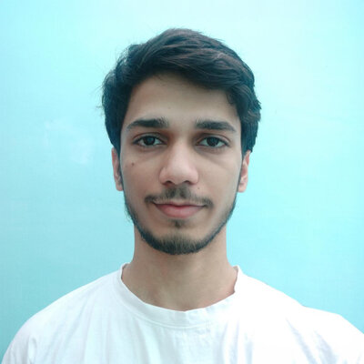
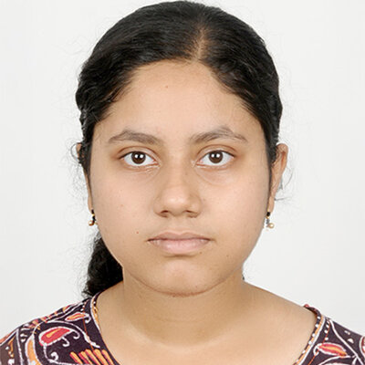

# Our Team

## Vatsal Sanjay (PI) 
[<i class="fab fa-github" style="font-size: 1.5em; color: black;"></i>](https://github.com/VatsalSy)
[<i class="ai ai-google-scholar-square" style="font-size: 1.5em;"></i>](https://scholar.google.com/citations?user=67aQviYAAAAJ)

- [Postdoc, Phys. Fluids - Univ. Twente / 2022-25](https://pof.tnw.utwente.nl/people/profile/1330)
- [Ph.D., Phys. Fluids - Univ. Twente / 2018-22](https://doi.org/10.3990/1.9789036554077)
- [B.Tech + M.Tech, Two-Phase Flow & Instability Lab, IIT-Roorkee / 2013-18](http://dx.doi.org/10.13140/RG.2.2.22294.04166)
- [Personal Website](https://vatsalsanjay.com)

**Research Interest:** see [here](https://comphy-lab.org/research)

[Download CV](https://raw.githubusercontent.com/VatsalSy/Vatsal_CV/master/Vatsal_CV.pdf){: .cv-button}

## Ayush Dixit (Ph.D) 
[<i class="fab fa-github" style="font-size: 1.5em; color: black;"></i>](https://github.com/ayushkumardixit)
[<i class="ai ai-google-scholar-square" style="font-size: 1.5em;"></i>](https://scholar.google.com/citations?hl=en&user=ws43SmkAAAAJ)

Joint with [Detlef Lohse](https://en.wikipedia.org/wiki/Detlef_Lohse)

- [Ph.D. Student, Phys. Fluids - Univ. Twente / 2023-now](https://pof.tnw.utwente.nl/people/profile/2068)
- [B.Tech + M.Tech, Two-Phase Flow & Instability Lab, IIT-Roorkee / 2018-23](http://dx.doi.org/10.13140/RG.2.2.23218.79040)

**Research Interest:** Viscoelastic flows, Bursting bubbles, Respiratory drops.

## Aman Bhargava (Ph.D) 
[<i class="fab fa-github" style="font-size: 1.5em; color: black;"></i>](https://github.com/amanb1901)
[<i class="ai ai-google-scholar-square" style="font-size: 1.5em;"></i>](https://scholar.google.com/citations?hl=en&user=AmGOP8gAAAAJ)

Joint with [Detlef Lohse](https://en.wikipedia.org/wiki/Detlef_Lohse)

- [Ph.D. Student, Phys. Fluids - Univ. Twente / 2024-now](https://pof.tnw.utwente.nl/people/profile/2120)
- M.Sc. Chemical Engineering, Purdue University / 2022-23
- B.Tech. (Hons.) Chemical Engineering, IIT-Bombay / 2018-22

**Research Interest:** Inertial contact line, Drop retraction

## Jnandeep Talukdar (M.Sc.) 
[<i class="fab fa-github" style="font-size: 1.5em; color: black;"></i>](https://github.com/spilltheT)
[<i class="ai ai-google-scholar-square" style="font-size: 1.5em;"></i>](https://scholar.google.com/citations?hl=en&user=Coxj4VQAAAAJ)

Joint with [Detlef Lohse](https://en.wikipedia.org/wiki/Detlef_Lohse)

- Ph.D. Student, Phys. Fluids - Univ. Twente / **starting** May 2025
- [M.Sc. Student, Phys. Fluids - Univ. Twente / 2023-25](https://pof.tnw.utwente.nl/people/profile/1938)
- B.Tech. Mechanical Engineering, IIT-Patna / 2019-23

**Research Interest:** Surfactant dynamics, Dissipative anomaly, Soft wetting.

## Saumili Jana (M.Sc.) 
[<i class="fab fa-github" style="font-size: 1.5em; color: black;"></i>](https://github.com/SaumiliJana)

Joint with [Detlef Lohse](https://en.wikipedia.org/wiki/Detlef_Lohse)

- Ph.D. Student, Phys. Fluids - Univ. Twente / **starting** Jul 2025
- B.Tech.+M.Tech. Student, IIT-Kharagpur / 2023-25
- [Research Intern, Phys. Fluids - Univ. Twente / 2024](https://pof.tnw.utwente.nl/people/profile/2152)

**Research Interest:** Soft impact.

## Floris Hoek (M.Sc.) 
[<i class="fab fa-github" style="font-size: 1.5em; color: black;"></i>](https://github.com/Floris-Hoek)

Joint with [Martin van der Hoef](https://pof.tnw.utwente.nl/people/profile/244) and [Alvaro Marin](https://pof.tnw.utwente.nl/people/profile/243)

- [M.Sc. Student, Phys. Fluids - Univ. Twente / 2024](https://pof.tnw.utwente.nl/people/profile/1937)

**Research Interest:** Molecular dynamics simulations of evaporation-driven colloidal self-assembly

## Milan Sent (B.Sc.) 
[<i class="fab fa-github" style="font-size: 1.5em; color: black;"></i>](https://github.com/mdjsent)

Joint with [Jacco Snoeijer](https://pof.tnw.utwente.nl/people/profile/21)

- [B.Sc. Student, Phys. Fluids - Univ. Twente / 2024](https://pof.tnw.utwente.nl/people/profile/2243)

**Research Interest:** Spinning Pizza

## Xiangyu Zhang (Guest) 
[<i class="fab fa-github" style="font-size: 1.5em; color: black;"></i>](https://github.com/zhangxyPHD)

Joint with [Detlef Lohse](https://en.wikipedia.org/wiki/Detlef_Lohse)

- [Guest Researcher, Phys. Fluids - Univ. Twente / 2024](https://pof.tnw.utwente.nl/people/profile/2209)
- City University of Hong Kong, China

**Research Interest:** Viscoplastic drop impact

